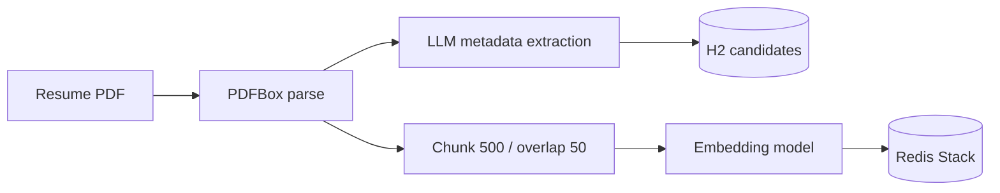
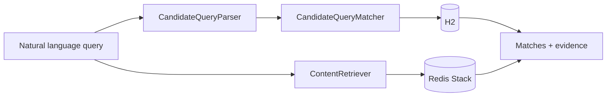
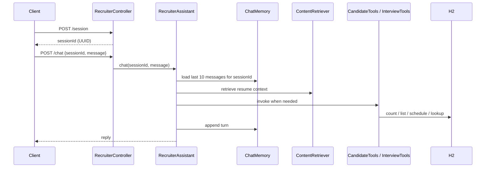
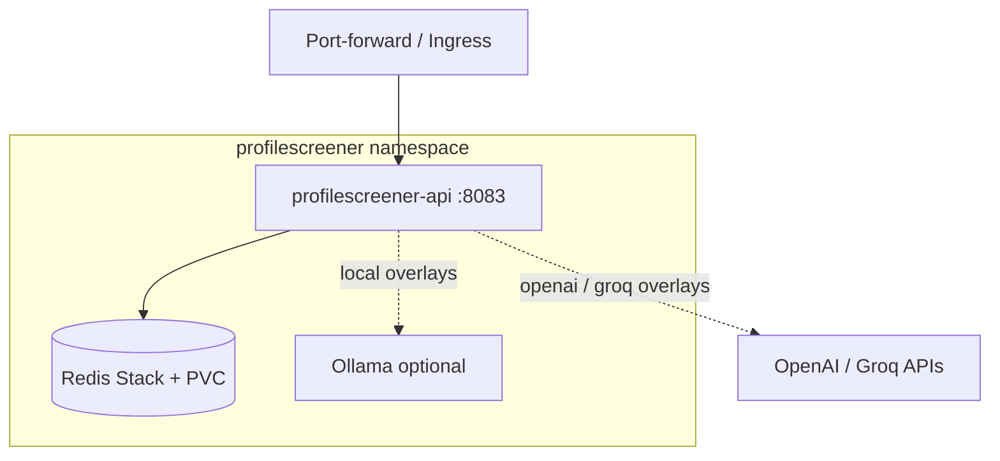

# Profile Scanner

Spring Boot recruiting assistant: ingest resume PDFs, semantic search over Redis Stack, hybrid RAG queries, and a LangChain4j agent with tools for candidate lookup and interview scheduling.

Maven artifact: `resume-rag-demo` · Product name: **Profile Scanner**

## Stack

| Layer | Choice |
|--------|--------|
| Runtime | Java 17, Spring Boot 3.4 |
| AI | LangChain4j 1.19 — OpenAI, Groq, or Ollama (profile-driven) |
| Vector store | Redis Stack (RediSearch + RedisJSON) |
| Structured data | H2 in-memory (`candidates`, `scheduled_interviews`) |
| PDF parsing | Apache PDFBox via LangChain4j |

## Project structure

```
resume-rag-demo/
├── src/main/java/com/team/resume/rag/
│   ├── config/              # RAG retriever, chat memory, app properties
│   ├── resume/              # Ingest, hybrid query, candidate domain
│   │   ├── controller/      # /api/resumes/*
│   │   ├── service/         # Ingestion, RAG query, query parser/matcher
│   │   ├── domain/          # Candidate entity
│   │   ├── dto/             # Request/response models
│   │   └── prompt/          # LLM extraction prompts
│   ├── recruiter/           # Chat agent API
│   │   ├── assistant/       # RecruiterAssistant (@AiService)
│   │   ├── controller/      # /api/recruiter/*
│   │   └── dto/
│   ├── candidate/tool/      # CandidateTools (@Tool)
│   └── interview/           # Interview scheduling
│       ├── tool/            # InterviewTools (@Tool)
│       ├── service/
│       └── domain/
├── src/main/resources/
│   ├── application.properties
│   └── application-{ollama,openai,groq-*,...}.properties
├── k8s/                     # Kustomize base + overlays (see below)
├── scripts/                 # deploy-*.sh, cleanup.sh
└── resumes/                 # Local PDF drop folder (gitignored)
```

## Data flow

### Ingest



### Hybrid query (`POST /api/resumes/query`)



Structured filters (skills, experience, CGPA/%) come from H2; Redis supplies resume excerpts. With no filters, pure RAG answers from top chunks (max 5, min score 0.6).

### Recruiter agent (`POST /api/recruiter/*`)



## Sessions, memory, and tools

**Session creation** — `POST /api/recruiter/session` returns a new `sessionId` (UUID) and a welcome message. Every chat request must include this `sessionId`.

**Memory** — `MessageWindowChatMemory` keeps the last **10 messages** per `sessionId` (in-process; lost on restart). LangChain4j binds memory via `@MemoryId` on `RecruiterAssistant.chat()`.

**Agent** — `RecruiterAssistant` is a LangChain4j `@AiService` with RAG (`ContentRetriever`) plus registered tools. The model decides when to retrieve resume context vs call a tool.

| Tool | Class | Purpose |
|------|-------|---------|
| `countCandidatesByProfile` | `CandidateTools` | Count by job profile |
| `findCandidatesWithTechnology` | `CandidateTools` | List candidates with a skill |
| `listAllCandidates` | `CandidateTools` | Full candidate list |
| `scheduleInterview` | `InterviewTools` | Book interview (date `yyyy-MM-dd`, time `HH:mm`) |
| `getScheduledInterviewsByProfileAndDate` | `InterviewTools` | Interviews for profile on a date |

## Kubernetes architecture

Chat and embeddings are **separate concerns**. Kustomize overlays pick the provider pair; Ollama is attached only when local models are needed.

```
k8s/
├── base/                  # namespace, API Deployment, Redis+PVC, ConfigMap, Secret
├── components/ollama/     # Ollama Deployment, Service, PVC (optional)
└── overlays/
    ├── openai/                  # OpenAI chat + OpenAI embeddings
    ├── groq-cloud-embedding/    # Groq chat + OpenAI embeddings
    ├── groq-local-embedding/    # Groq chat + Ollama embeddings
    └── local-slm/               # Ollama chat + Ollama embeddings
```



| Overlay | Pods | Chat | Embeddings | Redis dim |
|---------|------|------|------------|-----------|
| `openai` | API + Redis | OpenAI | OpenAI | 1536 |
| `groq-cloud-embedding` | API + Redis | Groq | OpenAI | 1536 |
| `groq-local-embedding` | API + Redis + Ollama | Groq | Ollama `nomic-embed-text` | 768 |
| `local-slm` | API + Redis + Ollama | Ollama `qwen3:1.7b` | Ollama `nomic-embed-text` | 768 |

**Deploy**

```bash
# Create secrets first (replace placeholders)
kubectl -n profilescreener create secret generic profilescreener-secrets \
  --from-literal=OPENAI_API_KEY='...' \
  --from-literal=GROQ_API_KEY='...' \
  --dry-run=client -o yaml | kubectl apply -f -

./scripts/deploy-openai.sh              # or deploy-groq-*, deploy-local.sh
kubectl -n profilescreener port-forward svc/profilescreener-api 8083:8083
```

Switching overlays with different embedding dimensions requires re-ingest (flush Redis index). H2 is in-memory inside the API pod — restart loses candidates/interviews. More detail: [`k8s/README.md`](k8s/README.md).

## Prerequisites

- Java 17+, Maven 3.9+
- Redis Stack (not plain Redis): `docker run -d -p 6379:6379 redis/redis-stack:latest`
- API key for your chosen profile (`OPENAI_API_KEY`, `GROQ_API_KEY`, or local Ollama)

## Run locally

```bash
export OPENAI_API_KEY=your-key          # if using openai / groq-cloud-embedding
export LLM_PROVIDER=openai              # ollama | openai | groq-cloud-embedding | groq-local-embedding
mvn spring-boot:run
```

App: **http://localhost:8083** · H2 console enabled for debugging.

## API

| Method | Path | Description |
|--------|------|-------------|
| POST | `/api/resumes/ingest` | Ingest all PDFs from `resumes/` |
| POST | `/api/resumes/upload` | Upload and ingest one PDF |
| GET | `/api/resumes/candidates` | List parsed candidates |
| POST | `/api/resumes/query` | Hybrid filter + RAG evidence |
| POST | `/api/recruiter/session` | Create chat session → `sessionId` |
| POST | `/api/recruiter/chat` | Agent chat (`sessionId` + `message`) |

## Quick demo

```bash
curl -X POST http://localhost:8083/api/resumes/ingest

curl -X POST http://localhost:8083/api/resumes/query \
  -H 'Content-Type: application/json' \
  -d '{"query":"Candidates with Spring Boot experience and 3+ years"}'

SESSION=$(curl -s -X POST http://localhost:8083/api/recruiter/session | jq -r .sessionId)

curl -X POST http://localhost:8083/api/recruiter/chat \
  -H 'Content-Type: application/json' \
  -d "{\"sessionId\":\"$SESSION\",\"message\":\"How many development profile candidates?\"}"
```

## Configuration

`src/main/resources/application.properties` — port `8083`, Redis host/index, `app.resumes.directory`. Provider-specific models and embedding dimensions live in `application-<profile>.properties`.

## Tests

```bash
mvn test
```

## Notes

- Redis Stack required for vector search; dimension must match the active embedding model.
- H2 resets on process stop; Redis embeddings persist until the index is flushed.
- Graduation filters apply to bachelor’s scores only, not school grades.
