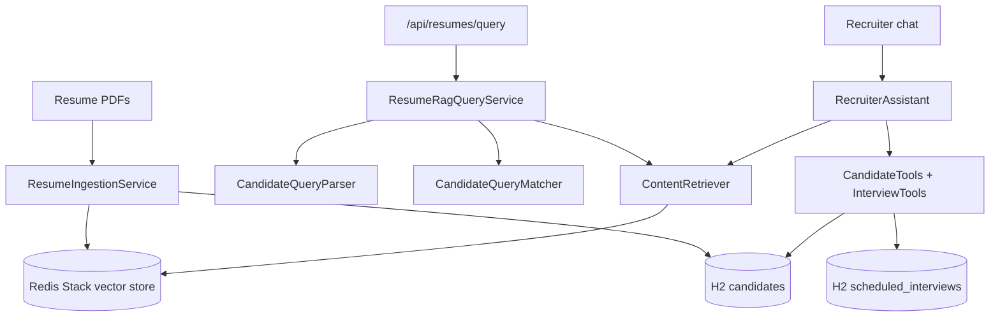

# Profile Scanner

Profile Scanner is a Spring Boot recruiting assistant that reads candidate resume PDFs, stores them for semantic search, and answers natural-language questions about who to interview.

It uses **LangChain4j** with OpenAI for embeddings and chat, **Redis Stack** as a vector store, and an in-memory **H2** database for structured candidate records and interview scheduling.

## What it does

- Ingest resume PDFs from a local `resumes/` folder or a single file upload
- Extract candidate metadata (name, email, profile, experience, technologies, graduation CGPA or percentage) with an LLM
- Chunk resume text, embed it, and store it in Redis Stack for RAG retrieval
- Persist parsed candidates in H2 for counts, technology lookups, and deterministic filters
- Answer recruiter questions with hybrid search: structured filters (experience, CGPA, percentage, skills) plus retrieved resume evidence
- Chat with a recruiter assistant that can list candidates, find skills, schedule interviews, and look up scheduled interviews

## Stack

| Layer | Choice |
|--------|--------|
| Runtime | Java 17, Spring Boot 3.4 |
| AI | LangChain4j 1.19, OpenAI `gpt-4o-mini` and `text-embedding-3-small` |
| Vector store | Redis Stack (RediSearch + RedisJSON) |
| Structured data | H2 in-memory (`candidates`, `scheduled_interviews`) |
| PDF parsing | Apache PDFBox via LangChain4j |

Maven artifact name remains `resume-rag-demo`; the product name is **Profile Scanner**.

## Architecture



**Ingest path:** PDF text is parsed, metadata is extracted to JSON, the candidate is saved in H2, and document chunks (about 500 characters, 50 overlap) are embedded and written to Redis with metadata such as `candidateId`, `fileName`, `candidateName`, and `profile`.

**Query path:** Natural-language queries are parsed into optional filters (technologies, years of experience, graduation scores). Matching candidates come from H2; Redis supplies supporting excerpts. If no structured filters are present, retrieval plus generation answers from the top matching chunks (up to 5, minimum similarity 0.6).

**Chat path:** `RecruiterAssistant` keeps per-session memory and calls tools for counts, technology search, listing candidates, and interview CRUD-style operations.

## Prerequisites

- Java 17+
- Maven 3.9+
- Redis Stack (not plain Redis)
- An OpenAI API key in the environment (do not commit keys)

Confirm Redis Stack modules:

```bash
redis-cli MODULE LIST
```

Run Redis Stack with Docker if needed:

```bash
docker run -d --name redis-stack -p 6379:6379 redis/redis-stack:latest
```

Set the API key in your shell (use your own key; never commit it):

```bash
export OPENAI_API_KEY=your-openai-api-key
```

## Run

From the project root:

```bash
mvn spring-boot:run
```

The app listens on **http://localhost:8083**. H2 console is enabled for local debugging.

## Add resumes

Drop PDF files into `resumes/` (this folder is gitignored), or upload one file:

```bash
curl -X POST http://localhost:8083/api/resumes/upload \
  -F "file=@/path/to/candidate-resume.pdf"
```

Then ingest everything in `resumes/`:

```bash
curl -X POST http://localhost:8083/api/resumes/ingest
```

Already-ingested files are skipped; new PDFs are parsed and indexed.

## API

| Method | Path | Description |
|--------|------|-------------|
| POST | `/api/resumes/ingest` | Ingest all PDFs from `resumes/` |
| POST | `/api/resumes/upload` | Upload and ingest a single PDF |
| GET | `/api/resumes/candidates` | List parsed candidates |
| POST | `/api/resumes/query` | Hybrid filter + RAG evidence and match explanations |
| POST | `/api/recruiter/session` | Create a chat session |
| POST | `/api/recruiter/chat` | Chat with RAG and tools (`sessionId` + `message`) |

## Demo flow

```bash
# 1. Ingest PDFs
curl -X POST http://localhost:8083/api/resumes/ingest

# 2. List parsed candidates
curl http://localhost:8083/api/resumes/candidates

# 3. Semantic query (retrieve + generate, includes source chunks)
curl -X POST http://localhost:8083/api/resumes/query \
  -H 'Content-Type: application/json' \
  -d '{"query":"Which candidates have hands-on Spring Boot experience?"}'

# Hybrid structured filters + Redis evidence
curl -X POST http://localhost:8083/api/resumes/query \
  -H 'Content-Type: application/json' \
  -d '{"query":"Name candidates with more than 3 years experience and graduation CGPA above 7.5 or percentage above 75"}'

# 4. Recruiter session
curl -X POST http://localhost:8083/api/recruiter/session

# 5. Chat (replace SESSION_ID)
curl -X POST http://localhost:8083/api/recruiter/chat \
  -H 'Content-Type: application/json' \
  -d '{"sessionId":"SESSION_ID","message":"How many candidates have a development profile?"}'

curl -X POST http://localhost:8083/api/recruiter/chat \
  -H 'Content-Type: application/json' \
  -d '{"sessionId":"SESSION_ID","message":"Which candidates have hands-on Spring Boot experience?"}'

curl -X POST http://localhost:8083/api/recruiter/chat \
  -H 'Content-Type: application/json' \
  -d '{"sessionId":"SESSION_ID","message":"Schedule an interview for Rahul Sharma on 2026-08-25 at 10:00. Profile is Java Developer, 5 years experience, email rahul@example.com"}'

curl -X POST http://localhost:8083/api/recruiter/chat \
  -H 'Content-Type: application/json' \
  -d '{"sessionId":"SESSION_ID","message":"How many Java developer interviews are scheduled on 2026-08-25?"}'
```

Interview dates use `yyyy-MM-dd`; times use 24-hour `HH:mm`.

## Configuration

Settings live in `src/main/resources/application.properties`.

- `server.port` — default `8083`
- `langchain4j.open-ai.*` — chat and embedding models; keys come from `OPENAI_API_KEY`
- `langchain4j.community.redis.*` — host, port, index `resume-embeddings`, dimension `1536`
- `app.resumes.directory` — resume PDF folder (default `resumes`)

## Tests

```bash
mvn test
```

Tests cover query parsing and matching, resume and recruiter HTTP APIs, candidate tools, and interview scheduling.

## Notes

- Redis vector search requires **Redis Stack**, not vanilla Redis.
- Embedding dimension `1536` matches `text-embedding-3-small`.
- H2 is in-memory; candidate and interview data reset when the process stops. Redis embeddings persist until you flush the index.
- Graduation filters apply to bachelor’s/graduation scores only, not school grades.
